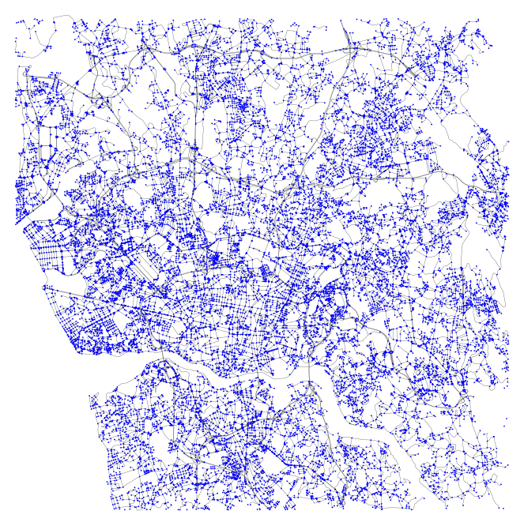

# ST4ML: Machine Learning Oriented Spatio-Temporal Data Processing at Scale


[Overview](#overview)

[Quick Start](#quick-start)

[Technical Features](#technical-features)

[Next Step](#next-step)

[References](#references)

## Overview


ST4ML is a distributed spatio-temporal(ST) data processing
system built on top of [Apache Spark][spark]. It facilitates data engineers and researchers to handle 
big ST data in a distributed manner and conveniently utilize the large amount of available ST data in supporting various ML applications.

Specifically, ST4ML provides:
- _Selection-Conversion-Extraction_, a three-stage pipeline that eases the programming effort of making big ST data ML-ready
- Efficient data ingestion and parsing of common formats (e.g., CSV + WKT) and public datasets (e.g. OSM and Porto taxi)
- Fundamental operation over spatial and ST objects (e.g., event, trajectory and raster)
- Abundant feature extraction functions (e.g., map matching, trajectory speed extraction, and anomaly events extraction)

## Quick Start
### Local environment setup
To test the first ST4ML application without a Spark cluster established, please follow the instruction to set 
up the single-machine environment:

Download the latest Spark from https://spark.apache.org/downloads.html and unzip it
```
tar zxvf spark-3.3.0-bin-hadoop3.tgz 
```

Clone this repo to local:
```
git clone https://github.com/Panrong/st-tool.git
```

### Application example
Run the following command as your first ST4ML application:

Compile ST4ML core and the example project:
```bash
cd PATH_TO_ST4ML/st4ml
sbt assembly

cd PATH_TO_ST4ML/examples
sbt assembly
```

Submit the example application to Spark:
```bash
bash PATH_TO_SPARK/bin/spark-submit\
 --master local[*]\
 --class AnomalyExtractionExample\
 --jars ../st4ml/target/scala-2.12/st4ml-assembly-3.0.jar\
 target/scala-2.12/st4ml_examples-assembly-0.1.jar
```

The following result shall appear (after some Spark logs) if the application is executed correctly:
```
============================================
== ST4ML example: finding abnormal events ==
============================================
Processing 9933 events
Extracted 2674 abnormal events occurring during 23 to 4.
2 examples: 
Map(vendor_id -> CMT, trip_distance -> 2.80, rate_code -> 1, dropoff_longitude -> -73.979507, pickup_latitude -> 40.78125, hack_license -> 768FD7AF6008C453A3A5CAD66813E4A0, pickup_longitude -> -73.946266, g -> POINT (-73.946266 40.78125), passenger_count -> 1, trip_time_in_secs -> 672, dropoff_datetime -> 2013-07-07 13:32:37, pickup_datetime -> 2013-07-07 13:21:25, dropoff_latitude -> 40.763603, medallion -> 768FD7AF6008C453A3A5CAD66813E4A0)
Map(vendor_id -> VTS, trip_distance -> 2.74, rate_code -> 1, dropoff_longitude -> -73.97673, pickup_latitude -> 40.781464, hack_license -> 768261A6327C320FD1F61E61B7F1358B, pickup_longitude -> -73.946503, g -> POINT (-73.946503 40.781464), passenger_count -> 5, trip_time_in_secs -> 600, dropoff_datetime -> 2013-07-07 12:43:00, pickup_datetime -> 2013-07-07 12:33:00, dropoff_latitude -> 40.760757, medallion -> 768261A6327C320FD1F61E61B7F1358B)

```

ST4ML is better to run on top of a Spark cluster with HDFS storage support. For programmers that are 
familiar with Spark and have the cluster set up, they may simply include the `jar` package of ST4ML as execution resources
to enjoy the ST functionalities. For new-comers to Spark, please follow the brief introduction [below](#next-step)
to  build up a distributed computation environment.

### Programming with ST4ML
#### Example background
Dividing an urban area into grids, researchers take historical traffic speeds of each grid cell to train an ML model and predict the future speeds. 
The model input is usually formulated as a sequence of 2-d matrices, where a matrix records the traffic speeds of the grids at a given time, 
and each element of the matrix is the average speed of a grid cell. 
Since the actual traffic speed (across the grids and time slots) is often not directly 
available, researchers need to derive them from other attainable data, such as the trajectories of individual vehicles.


#### Essential code

```scala
// define inputs
val (sArray, tArray) = ReadRaster(rasterDir)
val sRange = Extent(sArray).toPolygon
val tRange = Duration(tArray)

// instantiate operators
val selector = Selector(sRange, tRange, parallelism)
val converter = new Traj2RasterConverter(sArray, tArray)
val extractor = new RasterSpeedExtractor

// execute in a pipeline
val selectedRDD = selector.selectTrajCSV(trajDir)
println(s"--- Selected ${selectedRDD.count} trajectories")
val convertedRDD = converter.convert(selectedRDD)
println(s"--- Converted to ${converter.numCells} raster cells")
val extractedRDD = extractor.extract(convertedRDD, metric = "greatCircle", convertKmh = true)
println("=== Top 2 raster cells with the highest speed:")
extractedRDD.sortBy(_._2, ascending = false).take(2).foreach(println)
```

The complete example can be found at `examples/src/main/scala/AverageSpeedExample.scala`. 

## Technical Features
The figure below plots the main components of ST4ML's _three-stage pipeline_ abstraction.


In the **Selection** stage, ST4ML retrieves an in-memory subset from gigantic 
on-disk ST data according to specified ST constraints. 
ST datasets are of large scale while ML applications are often applied to a portion 
of them. Loading all data into memory leads to a waste of memory and computation. 
A <ins>persistent metadata</ins> scheme is proposed, which groups and indexes on-disk 
ST data so only partial data are loaded into memory while the ST locality is 
preserved. <ins>In-memory indexing</ins> is implemented for faster selection 
and multiple <ins>ST-partitioners</ins> are also proposed to achieve ST-aware load balance 
during distributed computations. 

In the **Conversion** stage, ST4ML describes ST data with <ins>five ST instances</ins>:
_event_, _trajectory_, _time series_, _spatial map_, and _raster_. 
These instances provide representative abstractions of ST data and are suitable 
for different feature extraction applications. 
Efficient conversions among the five ST instances are supported in ST4ML. 
The original ST data as one instance can be converted to the most appropriate 
instance according to the nature of the ML applications. 
Specific <ins>R-tree-based</ins> optimizations are designed to speed up expensive conversions and benefit 
the computation pipeline. 

In the **Extraction** stage, ST4ML takes user-specified feature extraction 
functions and executes them in parallel. To provide different levels of
<ins>flexibility</ins>, ST4ML _pre-builds common extraction functions, supports users to 
embed logics with instance-level APIs, as well as allows direct manipulation of RDDs._ 

Such a paradigm transforms the ML feature extraction problem into scalable 
distributed executions, and thus makes the best use of the underlying distributed computing platform.

We list the supported technique and operations:

|                        <span>       |     <span>                                                                                      |     
|--------------------------------|---------------------------------------------------------------------------------------------------------|
|           ST instances           |Event, Trajectory, Time Series, Spatial Map, Raster                            |
|          ST Partitioners         |                                   Hash, STR, T-STR, Quad-tree, T-balance                                  |
|            ST Indexers           |                                           (1-d, 2-d, 3-d) R-tree                                          |
|       Input ST data format       |                                              CSV+WKT, OSM map                                             |
| Build-in extraction applications | EventAnomalyExtractor, EventCompanionExtractor, EventClusterExtractor, TrajSpeedExtractor, TrajOdExtractor, TrajStayPointExtractor, TrajTurningExtractor, TrajCompanionExtractor, TsFlowExtractor, TsSpeedExtractor, TsWindowFreqExtractor, SmFlowExtractor, SmSpeedExtractor, SmTransitExtractor, RasterFlowExtractor, RasterSpeedExtractor RasterTransitExtractor                                         |

## Next Step
Please refer to the following documentation for a thorough guide on using ST4ML.
- [End-to-end examples](https://github.com/Panrong/st-tool/blob/instance/docs/examples.md)
- [API for data I/O](https://github.com/Panrong/st-tool/blob/instance/docs/data_standard.md)
- [Full documentation](https://github.com/Panrong/st-tool/blob/instance/docs/internal.md)
- Guide on installation and deployment (local mode, cluster mode, docker mode)
- Efficiency report

## References

Please cite our paper if you find ST4ML useful in your research.


## Toy Datasets

ST4ML supports automatically load and parse data with the following standard formats (more to be added).
Some toy datasets that can be accommodated in a single machine are provided as examples and located in `./datasets`.
### CSV + WKT
CSV is one of the most common human-readable format, and we use WKT standard to represent the geometries.
The CSV file should contain the following fields:

| column name           | explanation                                                                                                                  |
|-----------------------|------------------------------------------------------------------------------------------------------------------------------|
| shape                 | WKT format of a geometry, currently support POINT, LINESTRING, and POLYGON.                                                  |
| timestamp             | Numeric 10-bit epoch time (cannot together appear with duration or time).                                                    |
| duration              | A duration of format `timestamp, timestamp` (cannot together appear with timestamp or time).                                 |
| time                  | Time with yyyy-MM-dd HH:mm:ss format (cannot together appear with timestamp or duration). The time zone of SparkSession applies. |
| timestamps            | An array of timestamps separated by ", " to record the timestamps of a trajectory
| custom attribute name | Other attributes will be packed as a `Map` in Scala. The `value` will be of string type.                                                                          |


For example, an event in CSV like

| shape                      | timestamp          | id                  |
|----------------------------|--------------------|---------------------|
| POINT (-8.620326 41.14251) | 1372636888         | 1372636858620000589 |

will be converted to an ST4ML Event:

`Event(Entry(Point(-8.620326, 41.14251), Duration(1372636888, 1372636888)), Map("id" -> "1372636858620000589"))` 


**_NOTE:_**  In ST4ML's convention, a GPS point is denoted as `(longitude, latitude)`
### Toy Datasets
We provide the following toy datasets for users to get familiar with ST4ML and try their applications.
#### NYC Taxi (Point)

9933 taxi pick up/ drop off records retrieved from https://www1.nyc.gov/site/tlc/about/tlc-trip-record-data.page

Path: `./datasets/nyc_toy`

Preview: 
```
+----------------------------+----------+--------------------+----------+------------------+-----------------+---------------------------------+-------------------+---------------+-----------------+-------------------+--------------------+------------------+---------------------------------+-----------------------------+-----------+
|shape                       |timestamp | dropoff_datetime   |vendor_id | pickup_longitude | pickup_latitude | hack_license                    | trip_time_in_secs | trip_distance | passenger_count | dropoff_longitude | pickup_datetime    | dropoff_latitude | medallion                       | g                           | rate_code |
+----------------------------+----------+--------------------+----------+------------------+-----------------+---------------------------------+-------------------+---------------+-----------------+-------------------+--------------------+------------------+---------------------------------+-----------------------------+-----------+
|POINT (-73.953201 40.771488)|1373695500| 2013-07-13 02:05:00| VTS      | -73.958336       | 40.719078       | 452B322CA3BB3132FF0F59FADAE615D6| 960               | 5.47          | 2               | -73.953201        | 2013-07-13 01:49:00| 40.771488        | 452B322CA3BB3132FF0F59FADAE615D6| POINT (-73.958336 40.719078)| 1         |
|POINT (-73.949028 40.780659)|1373254679| 2013-07-07 23:43:04| CMT      | -73.949028       | 40.780659       | 0006C8F9279EFD18D8E70193D98499CB| 305               | 1.40          | 1               | -73.963455        | 2013-07-07 23:37:59| 40.769409        | 0006C8F9279EFD18D8E70193D98499CB| POINT (-73.949028 40.780659)| 1         |
+----------------------------+----------+--------------------+----------+------------------+-----------------+---------------------------------+-------------------+---------------+-----------------+-------------------+--------------------+------------------+---------------------------------+-----------------------------+-----------+
```


#### Porto Taxi (Trajectory)
This dataset contains 319 trajectories. We slightly modified the test dataset from https://www.kaggle.com/competitions/pkdd-15-predict-taxi-service-trajectory-i/ to make it with the standard WKT format and ST4ML timestamps.

Path: `./datasets/porto_toy`

Preview:
```
+---------------------------------------------------------------------------------------------------------------------------------------------------------------------------------------------------------------------------------------------------------------------------------------------------------------------------------------------------------------------------------------------------------------------------------------------------------------------------------------------------------------------------------------------------------------------------------------------------------------------------------------------------------------------------------------------------------------------------------------------------------------------------------------------------------------------------------------------------------------------------+----------------------------------------------------------------------------------------------------------------------------------------------------------------------------------------------------------------------------------------------------------------------------------------------------------------------------------------------------------------------------------------------------------------------------------------------------------------------------------------------+-------+---------+-----------+------------+--------+--------+------------+
|shape                                                                                                                                                                                                                                                                                                                                                                                                                                                                                                                                                                                                                                                                                                                                                                                                                                                                      |timestamps                                                                                                                                                                                                                                                                                                                                                                                                                                                                                    |TRIP_ID|CALL_TYPE|ORIGIN_CALL|ORIGIN_STAND|TAXI_ID |DAY_TYPE|MISSING_DATA|
+---------------------------------------------------------------------------------------------------------------------------------------------------------------------------------------------------------------------------------------------------------------------------------------------------------------------------------------------------------------------------------------------------------------------------------------------------------------------------------------------------------------------------------------------------------------------------------------------------------------------------------------------------------------------------------------------------------------------------------------------------------------------------------------------------------------------------------------------------------------------------+----------------------------------------------------------------------------------------------------------------------------------------------------------------------------------------------------------------------------------------------------------------------------------------------------------------------------------------------------------------------------------------------------------------------------------------------------------------------------------------------+-------+---------+-----------+------------+--------+--------+------------+
|LINESTRING (-8.585676 41.148522, -8.585712 41.148639, -8.585685 41.148855, -8.58573 41.148927, -8.585982 41.148963, -8.586396 41.148954, -8.586072 41.14872, -8.586324 41.147847, -8.586999 41.14746, -8.586576 41.147154, -8.584884 41.146623)                                                                                                                                                                                                                                                                                                                                                                                                                                                                                                                                                                                                                            |1408039037, 1408039052, 1408039067, 1408039082, 1408039097, 1408039112, 1408039127, 1408039142, 1408039157, 1408039172, 1408039187                                                                                                                                                                                                                                                                                                                                                            |T1     |B        |NA         |15          |20000542|A       |False       |
|LINESTRING (-8.610876 41.14557, -8.610858 41.145579, -8.610903 41.145768, -8.610444 41.146191, -8.609445 41.146758, -8.608896 41.147118, -8.608968 41.147127, -8.608707 41.147532, -8.608347 41.148117, -8.608149 41.148351, -8.608041 41.148576, -8.607654 41.14926, -8.607348 41.149899, -8.607393 41.149899, -8.607357 41.149962, -8.606817 41.150979, -8.606358 41.151915, -8.605719 41.152788, -8.604981 41.153319, -8.604783 41.154345, -8.604828 41.154372, -8.604801 41.155353, -8.604648 41.156775, -8.604522 41.158197, -8.604513 41.159943, -8.604378 41.160555, -8.604378 41.1606, -8.604369 41.160645, -8.60436 41.160807, -8.604162 41.161176, -8.604126 41.161248, -8.60409 41.161293, -8.60409 41.161266, -8.604108 41.161239, -8.604126 41.161194, -8.604135 41.161275, -8.60391 41.162049, -8.602929 41.162832, -8.602551 41.163111, -8.601894 41.163597)|1408038611, 1408038626, 1408038641, 1408038656, 1408038671, 1408038686, 1408038701, 1408038716, 1408038731, 1408038746, 1408038761, 1408038776, 1408038791, 1408038806, 1408038821, 1408038836, 1408038851, 1408038866, 1408038881, 1408038896, 1408038911, 1408038926, 1408038941, 1408038956, 1408038971, 1408038986, 1408039001, 1408039016, 1408039031, 1408039046, 1408039061, 1408039076, 1408039091, 1408039106, 1408039121, 1408039136, 1408039151, 1408039166, 1408039181, 1408039196|T2     |B        |NA         |57          |20000108|A       |False       |
+---------------------------------------------------------------------------------------------------------------------------------------------------------------------------------------------------------------------------------------------------------------------------------------------------------------------------------------------------------------------------------------------------------------------------------------------------------------------------------------------------------------------------------------------------------------------------------------------------------------------------------------------------------------------------------------------------------------------------------------------------------------------------------------------------------------------------------------------------------------------------+----------------------------------------------------------------------------------------------------------------------------------------------------------------------------------------------------------------------------------------------------------------------------------------------------------------------------------------------------------------------------------------------------------------------------------------------------------------------------------------------+-------+---------+-----------+------------+--------+--------+------------+

```
#### OSM Map

Users may download the map information from OSM and use our _convertTool_ located at `./preprocessing/process_osm.py` to extract ST4ML compatible road segment information 
 for future use (e.g., map matching and regional traffic analysis).

Path: `./datasets/osm_toy`

Preview: an OSM directory has two CSV files: 

`edges.csv`:  

```
+--------------------+----------+---------+--------------------+------+------------------+
|               shape|start_node| end_node|               osmid|oneway|            length|
+--------------------+----------+---------+--------------------+------+------------------+
|LINESTRING (-8.54...| 112624378|112624414|[232721629, 23272...|  True|1122.8519999999999|
|LINESTRING (-8.53...| 112624414|314536603|            28617905|  True|           215.817|
+--------------------+----------+---------+--------------------+------+------------------+
```

`nodes.csv`:
```
+---------+----------------------------+
|osmid    |shape                       |
+---------+----------------------------+
|112624378|POINT(-8.5470652 41.1446972)|
|112624414|POINT(-8.5389837 41.1371699)|
+---------+----------------------------+
```
<center>

| Visualization of range (-8.70, 41.10, -8.70, 41.25): |
|------------------------------------------------------|
|            |

</center>

[spark]: https://spark.apache.org/