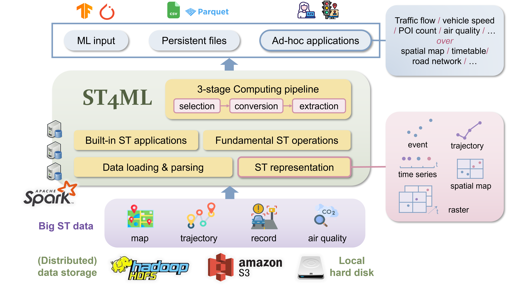

# ST4ML: Machine Learning Oriented Spatio-Temporal Data Processing at Scale

## Overview


<div align="center">

|  |
|---------------------------------------------|

</div>

ST4ML is a distributed spatio-temporal (ST) data processing
system built on top of [Apache Spark](https://spark.apache.org/). It facilitates data engineers and researchers to efficiently handle 
big ST data and conveniently utilize the large amount of available ST data in supporting various ML applications.

Specifically, ST4ML provides:
- _Selection-Conversion-Extraction_, a **three-stage computing pipeline** that eases the programming effort of making big ST data ML-ready
- Efficient **ST data ingestion and parsing** of common formats (e.g., CSV + WKT) and public datasets (e.g., OSM and Porto taxi trajectory)
- **Fundamental operation** over spatial and ST objects (event, trajectory, spatial map, time series, and raster)
- **Abundant built-in feature extraction functions** (e.g., map matching, trajectory speed extraction, and anomaly events extraction)

The target users of ST4ML are expected to program with `Scala`, while being familiar with Spark is a plus. 

## Getting Started (with an example)

We demonstrate the usage of ST4ML with an example - <ins>_"extracting the hourly average speed of roads from vehicle trajectories"_</ins>. Other applications
can be developed following the same pattern.

<div align="center">

| Illustration                               | Trajectory Example                                                                                                                                                                       |
|--------------------------------------------|------------------------------------------------------------------------------------------------------------------------------------------------------------------------------------------|
|  | <div style="width: 200px"> <br/>ID: 6200589, <br/>StartTime: 2013-07-01 0:00:58, <br/>Locations: [(-8.618643, 41.141412),<br/> (-8.618499, 41.141376), ...],<br/>SamplingRate: 15s</div> |

</div>


The application can be realized in three steps: (1) select the trajectories of interest from a gigantic trajectory dataset,
(2) assign the selected trajectories to the road segments,
and (3) find the average speed for each segment. For simplicity, we assume that the trajectories are already projected to the roads in 
this example. Note that ST4ML provides a [map-matching](https://github.com/Panrong/st4ml/blob/instance/docs/examples.md#map-matching) function to deal 
with noisy trajectories.

The detailed implementation is as follows:

### Environment Setup
To develop applications with ST4ML, ensure the following pre-requisites are installed:
`Java`, `Scala`, `SBT`. If deploying in a distributed cluster, `HDFS` is also required.
- Install Spark. For single machine environment, download the compiled [Spark package](https://spark.apache.org/downloads.html) and unzip it. ST4ML is better run in a distributed
Spark cluster. Programmers that are new to Spark may refer to this [guideline](https://github.com/Panrong/st4ml/blob/instance/docs/installation.md) for environment setup. ST4ML is compatible
with conventional Spark environment and no additional action is needed for an established Spark cluster.
- Clone this repo and compile `st4ml-core` with `SBT`.
    ```bash
    cd st4ml/st4ml-core && sbt assembly
    ```
- The `jar` package of `st4ml-core` is located at `st4ml-core/target/scala-2.1x/st4ml-assembly-3.0.jar`.
- In the distributed environment, ST4ML is only required to compile on the master machine.
  
### Reading and Parsing ST data

First, the ST data has to be loaded into memory from data storage.
ST4ML represents ST data with 5 fundamental ST instances: Event, Trajectory, Time Series, Spatial Map and Raster.
After parsing the data as ST instances, the programmer may later enjoy the abundant functionalities provided by ST4ML.
The detailed instance construction and APIs can be found [here](https://github.com/Panrong/st4ml/blob/instance/docs/internal.md).

In this example, _trajectories_ and _road network_ have to be read.
The trajectories are loaded as `Trajectory` while the road network is loaded as `Raster`.

ST4ML provides built-in data ingestion functions for some commonly used data representations, such as OSM map and WKT objects ([details](https://github.com/Panrong/st4ml/blob/instance/docs/toy_data.md)).
If the data format complies with ST4ML's standard,the programmer may simply pass the data directory to ST4ML's data loading functions (as line 2 and 7 in the code block below suggest).

For customized data, the programmer may (1) convert their data to ST4ML-supported data representations or (2) write code
to read the data as ST4ML in-memory data instance ([details](https://github.com/Panrong/st4ml/blob/instance/docs/data_standard.md)).

### Developing Applications

This speed extraction problem fits in ST4ML's _Selection-Conversion-Extraction_ pipeline. The `Selector` first selects the data of interest - inside a specific ST range. Next, a `Converter` converts the trajectories 
to a raster, based on the road network and time interval information (1h), resulting in an ST `Raster`. Finally, the built-in `Extractor` is invoked to extract
the average speed of each raster cell. The essential code is as follows:

```scala
// define inputs
val (sArray, tArray) = ReadRaster(rasterDir)
val sRange = Extent(sArray).toPolygon
val tRange = Duration(tArray)

// instantiate operators
val selector = Selector(sRange, tRange, parallelism)
val converter = new Traj2RasterConverter(sArray, tArray)
val extractor = new RasterSpeedExtractor

// execute in a pipeline
val selectedRDD = selector.selectTrajCSV(trajDir)
val convertedRDD = converter.convert(selectedRDD)
val extractedRDD = extractor.extract(convertedRDD, metric = "greatCircle", convertKmh = true)
println("=== Top 2 raster cells with the highest speed:")
extractedRDD.sortBy(_._2, ascending = false).take(2).foreach(println)
```

The application is Spark-complied, which can be executed with high efficiency in the distributed environment. 

The APIs of ST4ML operators can be found [here](https://github.com/Panrong/st4ml/blob/instance/docs/internal.md).

Besides the built-in extractors, the programmer may also define their own extraction logic on ST instances.
An example can be found [here]([details](https://github.com/Panrong/st4ml/blob/instance/docs/examples.md)).


### Application Execution with Spark
Once the application is written, the programmer may compile it to a `jar` package using `sbt package`.
The application is executed with `spark-submit`, with `ST4ML_CORE.jar` supplied:
  ```bash
    spark-submit --class xxx --jars PATH_TO_ST4ML_CORE PATH_TO_APP
  ```

 A runnable example can be found at [`examples/src/main/scala/AverageSpeedExample.scala`](https://github.com/Panrong/st4ml/blob/instance/examples/src/main/scala/AverageSpeedExample.scala).


## Feature Overview

The table below lists the current supported instances, techniques, and operations, which are expected to be expanded along time.

| Features                             | Supported items                                                                                                                                                                                                                                                                                                                                                     |     
|--------------------------------------|---------------------------------------------------------------------------------------------------------------------------------------------------------------------------------------------------------------------------------------------------------------------------------------------------------------------------------------------------------------------|
| **ST instances**                     | Event, Trajectory, Time Series, Spatial Map, Raster                                                                                                                                                                                                                                                                                                                 |
| **ST partitioners**                  | Hash, STR, T-STR, Quad-tree, T-balance                                                                                                                                                                                                                                                                                                                              |
| **ST indexers**                      | (1-d, 2-d, 3-d) R-tree                                                                                                                                                                                                                                                                                                                                              |
| **Input ST data format**             | CSV+WKT, OSM map                                                                                                                                                                                                                                                                                                                                                    |
| **Built-in extraction applications** | EventAnomalyExtractor, EventCompanionExtractor, EventClusterExtractor, TrajSpeedExtractor, TrajOdExtractor, TrajStayPointExtractor, TrajTurningExtractor, TrajCompanionExtractor, TsFlowExtractor, TsSpeedExtractor, TsWindowFreqExtractor, SmFlowExtractor, SmSpeedExtractor, SmTransitExtractor, RasterFlowExtractor, RasterSpeedExtractor RasterTransitExtractor |


## Next Step
Please refer to the following documentation for a thorough guide on using ST4ML.
- [Spark installation guide](https://github.com/Panrong/st4ml/blob/instance/docs/installation.md)
- [Environment and installation check](https://github.com/Panrong/st4ml/blob/instance/docs/quickstart.md)
- [Technical highlights](https://github.com/Panrong/st4ml/blob/instance/docs/techdetail.md)
- [ST4ML data standard](https://github.com/Panrong/st4ml/blob/instance/docs/data_standard.md), [Supported one-line data input format and toy datasets](https://github.com/Panrong/st4ml/blob/instance/docs/toy_data.md)
- [Full programming guide and APIs](https://github.com/Panrong/st4ml/blob/instance/docs/internal.md)
- [End-to-end examples](https://github.com/Panrong/st4ml/blob/instance/docs/examples.md)


## References

Please cite our paper if you find ST4ML useful in your research and development.

>  Kaiqi Liu, Panrong Tong, Mo Li, Yue Wu, and Jianqiang Huang. 2023. ST4ML: Machine Learning Oriented
Spatio-Temporal Data Processing at Scale. _Proc. ACM Manag. Data._ 1, 1, Article 87 (May 2023), 28 pages.
https://doi.org/10.1145/3588941


