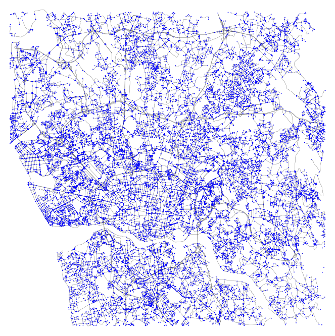

## Toy Datasets

ST4ML supports automatically load and parse data with the following standard formats (more to be added).
Some toy datasets that can be accommodated in a single machine are provided as examples and located in `./datasets`.
### CSV + WKT
CSV is one of the most common human-readable format, and we use WKT standard to represent the geometries.
The CSV file should contain the following fields:

| column name           | explanation                                                                                                                  |
|-----------------------|------------------------------------------------------------------------------------------------------------------------------|
| shape                 | WKT format of a geometry, currently support POINT, LINESTRING, and POLYGON.                                                  |
| timestamp             | Numeric 10-bit epoch time (cannot together appear with duration or time).                                                    |
| duration              | A duration of format `timestamp, timestamp` (cannot together appear with timestamp or time).                                 |
| time                  | Time with yyyy-MM-dd HH:mm:ss format (cannot together appear with timestamp or duration). The time zone of SparkSession applies. |
| timestamps            | An array of timestamps separated by ", " to record the timestamps of a trajectory
| custom attribute name | Other attributes will be packed as a `Map` in Scala. The `value` will be of string type.                                                                          |


For example, an event in CSV like

| shape                      | timestamp          | id                  |
|----------------------------|--------------------|---------------------|
| POINT (-8.620326 41.14251) | 1372636888         | 1372636858620000589 |

will be converted to an ST4ML Event:

`Event(Entry(Point(-8.620326, 41.14251), Duration(1372636888, 1372636888)), Map("id" -> "1372636858620000589"))`


**_NOTE:_**  In ST4ML's convention, a GPS point is denoted as `(longitude, latitude)`
### Toy Datasets
We provide the following toy datasets for users to get familiar with ST4ML and try their applications.
#### NYC Taxi (Point)

9933 taxi pick up/ drop off records retrieved from https://www1.nyc.gov/site/tlc/about/tlc-trip-record-data.page

Path: `./datasets/nyc_toy`

Preview:
```
+----------------------------+----------+--------------------+----------+------------------+-----------------+---------------------------------+-------------------+---------------+-----------------+-------------------+--------------------+------------------+---------------------------------+-----------------------------+-----------+
|shape                       |timestamp | dropoff_datetime   |vendor_id | pickup_longitude | pickup_latitude | hack_license                    | trip_time_in_secs | trip_distance | passenger_count | dropoff_longitude | pickup_datetime    | dropoff_latitude | medallion                       | g                           | rate_code |
+----------------------------+----------+--------------------+----------+------------------+-----------------+---------------------------------+-------------------+---------------+-----------------+-------------------+--------------------+------------------+---------------------------------+-----------------------------+-----------+
|POINT (-73.953201 40.771488)|1373695500| 2013-07-13 02:05:00| VTS      | -73.958336       | 40.719078       | 452B322CA3BB3132FF0F59FADAE615D6| 960               | 5.47          | 2               | -73.953201        | 2013-07-13 01:49:00| 40.771488        | 452B322CA3BB3132FF0F59FADAE615D6| POINT (-73.958336 40.719078)| 1         |
|POINT (-73.949028 40.780659)|1373254679| 2013-07-07 23:43:04| CMT      | -73.949028       | 40.780659       | 0006C8F9279EFD18D8E70193D98499CB| 305               | 1.40          | 1               | -73.963455        | 2013-07-07 23:37:59| 40.769409        | 0006C8F9279EFD18D8E70193D98499CB| POINT (-73.949028 40.780659)| 1         |
+----------------------------+----------+--------------------+----------+------------------+-----------------+---------------------------------+-------------------+---------------+-----------------+-------------------+--------------------+------------------+---------------------------------+-----------------------------+-----------+
```


#### Porto Taxi (Trajectory)
This dataset contains 319 trajectories. We slightly modified the test dataset from https://www.kaggle.com/competitions/pkdd-15-predict-taxi-service-trajectory-i/ to make it with the standard WKT format and ST4ML timestamps.

Path: `./datasets/porto_toy`

Preview:
```
+---------------------------------------------------------------------------------------------------------------------------------------------------------------------------------------------------------------------------------------------------------------------------------------------------------------------------------------------------------------------------------------------------------------------------------------------------------------------------------------------------------------------------------------------------------------------------------------------------------------------------------------------------------------------------------------------------------------------------------------------------------------------------------------------------------------------------------------------------------------------------+----------------------------------------------------------------------------------------------------------------------------------------------------------------------------------------------------------------------------------------------------------------------------------------------------------------------------------------------------------------------------------------------------------------------------------------------------------------------------------------------+-------+---------+-----------+------------+--------+--------+------------+
|shape                                                                                                                                                                                                                                                                                                                                                                                                                                                                                                                                                                                                                                                                                                                                                                                                                                                                      |timestamps                                                                                                                                                                                                                                                                                                                                                                                                                                                                                    |TRIP_ID|CALL_TYPE|ORIGIN_CALL|ORIGIN_STAND|TAXI_ID |DAY_TYPE|MISSING_DATA|
+---------------------------------------------------------------------------------------------------------------------------------------------------------------------------------------------------------------------------------------------------------------------------------------------------------------------------------------------------------------------------------------------------------------------------------------------------------------------------------------------------------------------------------------------------------------------------------------------------------------------------------------------------------------------------------------------------------------------------------------------------------------------------------------------------------------------------------------------------------------------------+----------------------------------------------------------------------------------------------------------------------------------------------------------------------------------------------------------------------------------------------------------------------------------------------------------------------------------------------------------------------------------------------------------------------------------------------------------------------------------------------+-------+---------+-----------+------------+--------+--------+------------+
|LINESTRING (-8.585676 41.148522, -8.585712 41.148639, -8.585685 41.148855, -8.58573 41.148927, -8.585982 41.148963, -8.586396 41.148954, -8.586072 41.14872, -8.586324 41.147847, -8.586999 41.14746, -8.586576 41.147154, -8.584884 41.146623)                                                                                                                                                                                                                                                                                                                                                                                                                                                                                                                                                                                                                            |1408039037, 1408039052, 1408039067, 1408039082, 1408039097, 1408039112, 1408039127, 1408039142, 1408039157, 1408039172, 1408039187                                                                                                                                                                                                                                                                                                                                                            |T1     |B        |NA         |15          |20000542|A       |False       |
|LINESTRING (-8.610876 41.14557, -8.610858 41.145579, -8.610903 41.145768, -8.610444 41.146191, -8.609445 41.146758, -8.608896 41.147118, -8.608968 41.147127, -8.608707 41.147532, -8.608347 41.148117, -8.608149 41.148351, -8.608041 41.148576, -8.607654 41.14926, -8.607348 41.149899, -8.607393 41.149899, -8.607357 41.149962, -8.606817 41.150979, -8.606358 41.151915, -8.605719 41.152788, -8.604981 41.153319, -8.604783 41.154345, -8.604828 41.154372, -8.604801 41.155353, -8.604648 41.156775, -8.604522 41.158197, -8.604513 41.159943, -8.604378 41.160555, -8.604378 41.1606, -8.604369 41.160645, -8.60436 41.160807, -8.604162 41.161176, -8.604126 41.161248, -8.60409 41.161293, -8.60409 41.161266, -8.604108 41.161239, -8.604126 41.161194, -8.604135 41.161275, -8.60391 41.162049, -8.602929 41.162832, -8.602551 41.163111, -8.601894 41.163597)|1408038611, 1408038626, 1408038641, 1408038656, 1408038671, 1408038686, 1408038701, 1408038716, 1408038731, 1408038746, 1408038761, 1408038776, 1408038791, 1408038806, 1408038821, 1408038836, 1408038851, 1408038866, 1408038881, 1408038896, 1408038911, 1408038926, 1408038941, 1408038956, 1408038971, 1408038986, 1408039001, 1408039016, 1408039031, 1408039046, 1408039061, 1408039076, 1408039091, 1408039106, 1408039121, 1408039136, 1408039151, 1408039166, 1408039181, 1408039196|T2     |B        |NA         |57          |20000108|A       |False       |
+---------------------------------------------------------------------------------------------------------------------------------------------------------------------------------------------------------------------------------------------------------------------------------------------------------------------------------------------------------------------------------------------------------------------------------------------------------------------------------------------------------------------------------------------------------------------------------------------------------------------------------------------------------------------------------------------------------------------------------------------------------------------------------------------------------------------------------------------------------------------------+----------------------------------------------------------------------------------------------------------------------------------------------------------------------------------------------------------------------------------------------------------------------------------------------------------------------------------------------------------------------------------------------------------------------------------------------------------------------------------------------+-------+---------+-----------+------------+--------+--------+------------+

```
#### OSM Map

Users may download the map information from OSM and use our _convertTool_ located at `./preprocessing/process_osm.py` to extract ST4ML compatible road segment information
for future use (e.g., map matching and regional traffic analysis).

Path: `./datasets/osm_toy`

Preview: an OSM directory has two CSV files:

`edges.csv`:

```
+--------------------+----------+---------+--------------------+------+------------------+
|               shape|start_node| end_node|               osmid|oneway|            length|
+--------------------+----------+---------+--------------------+------+------------------+
|LINESTRING (-8.54...| 112624378|112624414|[232721629, 23272...|  True|          1122.852|
|LINESTRING (-8.53...| 112624414|314536603|            28617905|  True|           215.817|
+--------------------+----------+---------+--------------------+------+------------------+
```

`nodes.csv`:
```
+---------+----------------------------+
|osmid    |shape                       |
+---------+----------------------------+
|112624378|POINT(-8.5470652 41.1446972)|
|112624414|POINT(-8.5389837 41.1371699)|
+---------+----------------------------+
```
<center>

| Visualization of range (-8.70, 41.10, -8.70, 41.25): |
|-----------------------------------------------------|
|            |

</center>